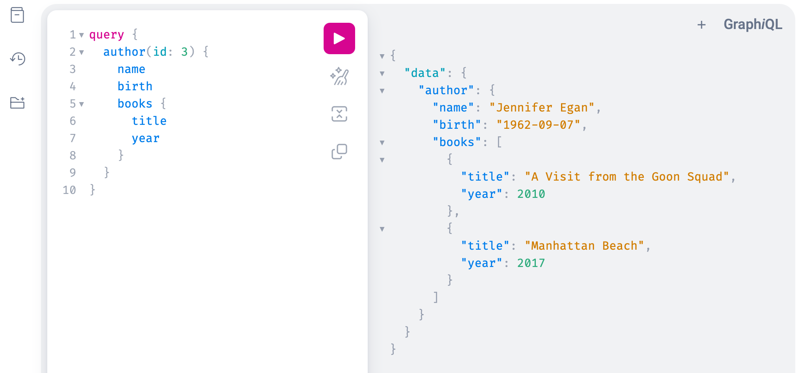

# GraphQL with Netflix DGS
This is a demo of the [Netflix DGS framework](https://netflix.github.io/dgs/) to create GraphQL services with Spring Boot.

It showcases a toy store with books, their authors, and sales records.
The DGS data fetches allow to implement nested queries of arbitrary depth.

## Run the Server
```
mvn spring-boot:run
```

The DGS services exposes an interactive GraphQL client on the URL
```
http://localhost:8080/graphiql
```




## Example Queries, Mutations, and Subscriptions
Show name, birthdate of the author with ID 3, plus title and year of all their books:
```graphql
query {
  author(id: 3) {
    name
    birth
    books {
      title
      year  
    }
  }
}
```
Create a new author:
```graphql
mutation {
  createAuthor(name: "John Steinbeck", birth: "1902-02-27", city: "Salinas") {
    id
    name
  }
}
```
To improve reuse, the mutation can be wrapped into a function, which takes its arguments from a variables object:
```graphql
mutation CreateAuthor($name: String!, $birth: String, $city: String) {
  createAuthor(name: $name, birth: $birth, city: $city) {
    id
    name
  }
}
```
with example data in variables:
```json
{
  "name": "John Steinbeck",
  "birth": "1902-02-27",
  "city": "Salinas"
}
```
Create a new book for the author:
```graphql
mutation {
  createBook(title: "Of Mice and Men", year: 1937, authorId: 5) {
    id
    title
  }
}
```
Subscribe to book-sale events issued by the server:
```graphql
subscription {
  sales {
    book {
      title
    }
    sales
  }
}
```

## Curl Equivalents
GraphQL queries and mutations can also be executed by curl or other command-line HTTP clients.
Below are the curl equivalents to the query and mutations above:
```shell
curl -X POST \
  -H 'Content-Type: application/json' \
  -d '{"query": "query { author(id: 3) { name birth books { title year } } }"}' \
  http://localhost:8080/graphql
```
```shell
curl -X POST \
  -H "Content-Type: application/json" \
  -d '{"query": "mutation { createAuthor(name: \"John Steinbeck\", birth: \"1902-02-27\", city: \"Salinas\") { id name } }"}' \
  http://localhost:8080/graphql
```
```shell
curl -X POST \
  -H "Content-Type: application/json" \
  -d '{"query": "mutation { createBook(title: \"Of Mice and Men\", year: 1937, authorId: 5) { id title } }"}' \
  http://localhost:8080/graphql
```
GraphQL subscriptions are not supported by curl, see https://stackoverflow.com/a/47860810.


